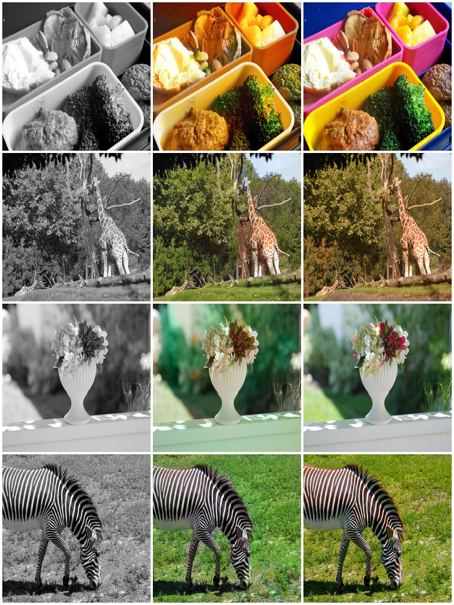

# ChromaForge

<div align="center">
  
  <p><em>From left to right: Grayscale input, ChromaForge cGAN colorization, Original ground truth</em></p>
</div>

Automatic grayscale image colorization using a conditional generative adversarial network. The generator learns to predict chrominance from luminance by competing against a patch-level discriminator trained to distinguish real from synthesized colors.

**Live demo:** [chromaforge.biraj-subedi.com.np](https://chromaforge.biraj-subedi.com.np)  
**API:** [birajsubedi-chromaforge-api.hf.space](https://birajsubedi-chromaforge-api.hf.space)  
**Report:** [`docs/latex/chromaforge_report.tex`](docs/latex/chromaforge_report.tex)

[](LICENSE)
[](https://huggingface.co/spaces/birajsubedi/chromaforge-api)

---

## Overview

ChromaForge operates in the CIE LAB color space. Given a grayscale image — which is equivalent to the L (lightness) channel — the model predicts the A and B (chrominance) channels. This formulation, introduced by Zhang et al. (2016), avoids the entanglement of color and brightness that makes RGB-based colorization harder to learn.

The project compares three progressively capable formulations trained on the same dataset under identical conditions:

| Model | PSNR (dB) ↑ | SSIM ↑ | Colorfulness ↑ |
|-------|------------:|-------:|---------------:|
| CNN regression baseline | 23.24 | 0.909 | 13.7 |
| U-Net + L1 loss | **23.74** | **0.914** | 16.1 |
| U-Net + cGAN (this work) | 23.67 | 0.891 | **31.8** |

*Note: Baselines trained on 20k-image subset (20 epochs); cGAN trained on full 118k dataset (100 epochs). See report for discussion of this asymmetry.*

---

## Architecture

```
Input  (1 × 256 × 256)  — normalized L channel

Encoder   64 → 128 → 256 → 512 → 512 → 512 → 512 → 512
                                                      ↕  bottleneck
Decoder  512 → 512 → 512 → 512 → 256 → 128 →  64 →  2
          └─────────────── skip connections ───────────┘

Output (2 × 256 × 256)  — predicted AB channels → tanh

Discriminator  cat(L, AB) → 64 → 128 → 256 → 512 → (30 × 30) patch logits
```

Generator: 54M parameters. Discriminator: 2.8M parameters (inference only).

Loss: `L_G = L_adv + 100 × L_L1`

---

## Repository

```
chromaforge/
├── backend/
│   ├── main.py               
│   ├── discriminator.py      
│   ├── Dockerfile            
│   └── requirements.txt      
├── frontend/
│   └── src/
│       ├── App.js
│       ├── components/
│       │   ├── Colorizer.js
│       │   └── ComparisonSlider.js
│       ├── hooks/useDrop.js
│       └── utils/api.js
├── training/
│   └── train_cgan.ipynb
└── docs/
    └── latex/
        └── chromaforge_report.tex
```

---

## Running locally

**Backend**
```bash
cd backend
pip install -r requirements.txt
uvicorn main:app --reload --port 7860
```

Place trained weights at `backend/weights/generator.pth` before starting.

**Frontend**
```bash
cd frontend
cp .env.example .env
npm install
npm start
```

Set `REACT_APP_API_URL` in `.env` to point at your backend.

**Training**

Open `training/train_cgan.ipynb` in Google Colab with a T4 GPU runtime. The notebook downloads COCO 2017, trains for 100 epochs, and saves the best generator weights to Google Drive.

---

## References

- Isola et al. (2017) — *Image-to-Image Translation with Conditional Adversarial Networks*
- Zhang et al. (2016) — *Colorful Image Colorization*
- Ronneberger et al. (2015) — *U-Net: Convolutional Networks for Biomedical Image Segmentation*
- Lin et al. (2014) — *Microsoft COCO: Common objects in context*

---

Biraj Subedi · Independent Researcher · [biraj-subedi.com.np](https://biraj-subedi.com.np)
